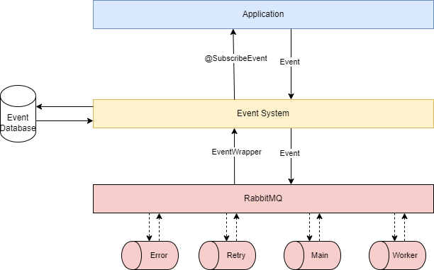

# Spring Boot Library implementation of Event System

[](https://codecov.io/github/Fezlight/spring-boot-starter-event-system)
[](https://maven-badges.herokuapp.com/maven-central/fr.fezlight/spring-boot-starter-event-system)

## Main Purpose

This library is dedicated to Spring Boot applications. Once it is included and enabled via `events.enabled` property it
will create all resources to handle event listening using RabbitMQ in your application. To avoid losing messages we
use `spring-modulith-events` and a database-backed system.

## Requirements

- Java 17+
- Spring Boot 3+
- RabbitMQ

## Getting Started

The library is published on Maven Central. The current version is `0.2.0`

Maven

```xml

<dependency>
    <groupId>fr.fezlight</groupId>
    <artifactId>spring-boot-starter-event-system</artifactId>
    <version>0.2.0</version>
</dependency>
```

Gradle

```groovy
    implementation 'fr.fezlight:spring-boot-starter-event-system:0.2.0'
```

See [Sonatype Maven Central](https://search.maven.org/artifact/fr.fezlight/spring-boot-starter-event-system) for
versions.

The library provides autoconfigured support for creating a basic implementation of an event handling system based on
the `events.enabled` property, which is true by default.

By design the event system requires a database to work. You have 2 starters available for that.

### Jdbc

Maven

```xml
<dependency>
    <groupId>fr.fezlight</groupId>
    <artifactId>spring-boot-starter-event-system-jdbc</artifactId>
    <version>0.2.0</version>
</dependency>
```

Gradle

```groovy
    implementation 'fr.fezlight:spring-boot-starter-event-system-jdbc:0.2.0'
```

The Jdbc implementation of Spring-Modulith beside need a table named **event_publications** to save all events
publications .

See : https://docs.spring.io/spring-modulith/reference/appendix.html#schemas

### MongoDB

Maven

```xml
<dependency>
    <groupId>fr.fezlight</groupId>
    <artifactId>spring-boot-starter-event-system-mongodb</artifactId>
    <version>0.2.0</version>
</dependency>
```

Gradle

```groovy
    implementation 'fr.fezlight:spring-boot-starter-event-system-mongodb:0.2.0'
```

## Usage

Once you have `events.enabled=true`, you can use the `@SubscribeEvent` annotation to listen automatically when an event
is fired within your application.

Basic Example

```java
import org.springframework.stereotype.Component;

@Component
public class SampleEventListener {

    @SubscribeEvent
    public void handleOrderValidated(OrderValidatedEvent event) {
        // Do some work with event ...
    }

}
```

In this example, the `@SubscribeEvent` annotation will implicitly register this method as the handler for any *
*OrderValidatedEvent**.

> The class must be registered as a valid spring beans to be eligible for subscribing to events.

### Fire an event

To fire an event, first you have to define a class corresponding to your event (e.g. OrderValidatedEvent). This class
must implement the **Event** interface.

```java
public class OrderValidatedEvent implements Event {
    private String id;
    // Some others properties
}
```

Once you have defined the event class, you will be able to fire events using the `ApplicationEventPublisher` bean.

```java
import org.springframework.stereotype.Service;
import org.springframework.context.ApplicationEventPublisher;

@Service
public class OrderService {
    private final ApplicationEventPublisher eventPublisher;

    public OrderService(ApplicationEventPublisher eventPublisher) {
        this.eventPublisher = eventPublisher;
    }

    @Transactional
    public void validateOrder(/* Some properties */) {
        // Do validate work ...

        var event = new OrderValidatedEvent();
        eventPublisher.publishEvent(event);
    }

}
```

By default, `spring-modulith` register a `ApplicationEventPublisher` bean with a TransactionalEventPublisher
implementation and places event publishing after the transaction completes to guarantee good consistency between your
application and event system.

### Retry an event

By default, an annotated method will not automatically retry an event.

If you want to change this behavior you can use the `retry` parameter within `@SubscribeEvent`.

```java
import org.springframework.stereotype.Component;

@Component
public class SampleEventListener {

    @SubscribeEvent(retry = 5)
    public void handleOrderValidated(OrderValidatedEvent event) {
        // Do some work with event ...
    }

}
```

### Conditional handling

By default, all method subscribing to an event type will consume event.

If you want to change this behavior you can use the `condition` parameter within `@SubscribeEvent`.
The syntax is a spring SpEL expression.

```java
import org.springframework.stereotype.Component;

@Component
public class SampleEventListener {

    @SubscribeEvent(condition = "#event.id == '15'")
    public void handleOrderValidated(OrderValidatedEvent event) {
        // Do some work with event ...
    }

}
```

Here the condition will consume event only when **OrderValidatedEvent.id** field equals to 15.

Keep attention at **#event**, it is declared by default with the first method parameter value (here *
*OrderValidatedEvent**) but name will always be **event**. There is no correlation between parameter name and condition
**#event**.

You can also use **#root** to filter value from **EventWrapper** object.

## Scheduled tasks

This library internally have two scheduled tasks :

- Remove completed tasks configured by `events.scheduled-task.complete-clear`
- Retry incomplete tasks configured by `events.scheduled-task.incomplete-retry`

These tasks can be enabled by setting `events.scheduled-task.enabled=true`.

### Multi-instance

If your application can be scaled up or if there is a possibility of multiple instances, you can
activate `events.scheduled-task.lock-enabled=true` to avoid any issues.

This configuration requires a table to work.

See : [ShedLock Documentation](https://github.com/lukas-krecan/ShedLock?tab=readme-ov-file#jdbctemplate)

## How it works ?

Here's the architecture of the event system.



Here is a more detail overview of the workflow of this library.

[Workflow Diagram](http://www.plantuml.com/plantuml/proxy?src=https://raw.githubusercontent.com/Fezlight/spring-boot-starter-event-system/main/resources/workflow.puml)

## Contributing

Pull requests are welcome. For major changes, please open an issue first to discuss what you would like to change.

Please make sure to update tests as appropriate.

## License

Spring Boot Library Event System is licensed under Apache License.

[Available here](https://www.apache.org/licenses/LICENSE-2.0.txt)
